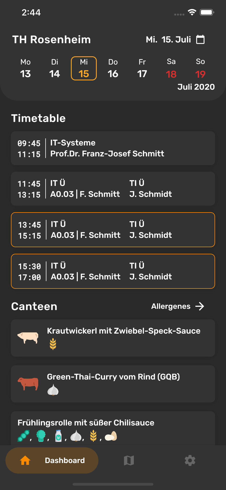
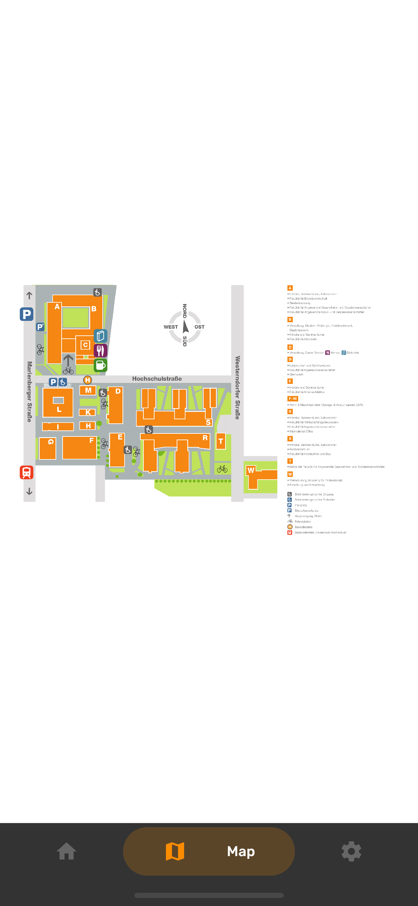
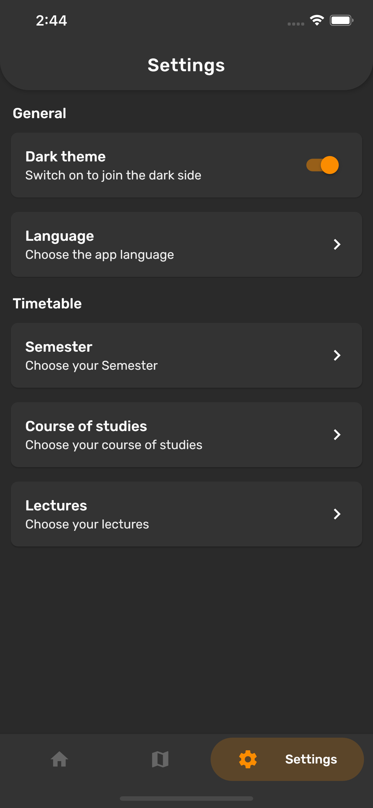
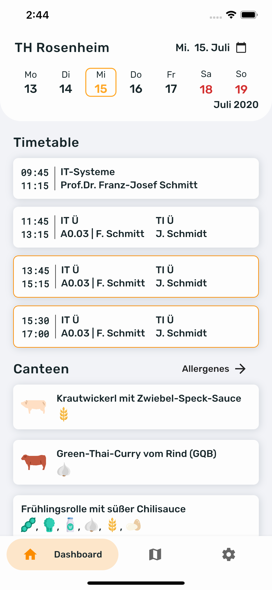
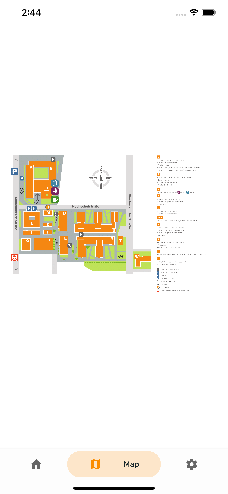
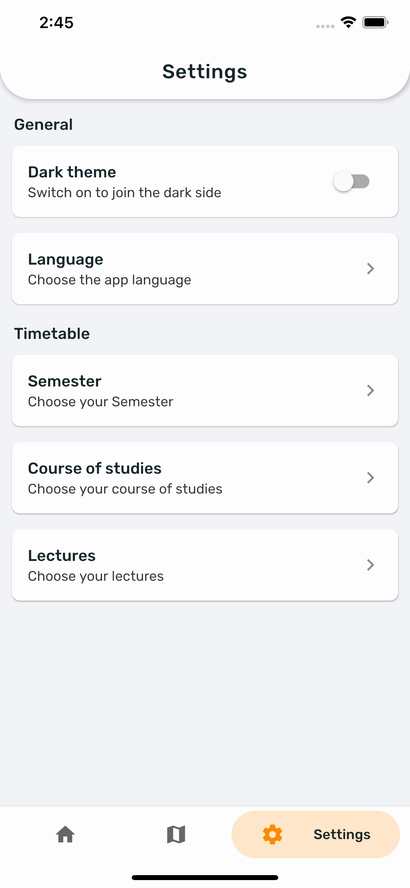

# Unofficial TH Rosenheim App

Diese Readme ist auch auf [Deutsch](README_DE.md) verfügbar.

This is a Cross-Platform Flutter App that displays customizable timetables as well as cantine information for students of the Rosenheim Technical University of Applied Sciences.

## Screenshots

The Data shown is not correct and just there for demonstration purposes.

### Dark mode

### Light mode

## Installation

Since this is an unofficial App it unfortunately cannot be released in the App Store or Google Play.

### Android

To use this Application on Android phones you can download the latest prebuilt apk.

TODO: Insert link when build pipeline is set up.

### IOS / Build from source

#### Introduction

Ios does not have an easy to use version of the Android apk therefore you will have to build the app from source. To do this you need a Mac or someone who has one since building IOS Apps is only possible under MacOS as of right now. For Android Windows and Linux are also fine.

#### Setup

First you have to follow the steps listed on flutter.dev [flutter.dev](https://flutter.dev/docs/get-started/) to setup Flutter on your System.

Now you can clone the repo with

`$ git clone https://github.com/devnico/th_rosenheim.git`

Now go into the new directory with

`$ cd th_rosenheim`

and get the required packages with

`$ flutter pub get`

#### Building and installing

Make sure your phone is connected and ready. For Android USB Debugging has to be enabled.

For IOS run

`$ flutter build ios --release && flutter install ios`

For Android run

`$ flutter build apk --release && flutter install apk`

## Contributing

Every contribution is very much appreciated. All contributors will get listed below ([emoji key](https://allcontributors.org/docs/en/emoji-key)):

<!-- ALL-CONTRIBUTORS-LIST:START - Do not remove or modify this section -->
<!-- prettier-ignore-start -->
<!-- markdownlint-disable -->
<table>
    <tr>
    <td align="center"><a href="https://github.com/DevNico"> <b>DevNico</b></a> <a href="https://github.com/devnico/th_rosenheim/commits?author=devnico" title="Code">💻</a></td>
    </tr>
</table>
<!-- markdownlint-enable -->
<!-- prettier-ignore-end -->
<!-- ALL-CONTRIBUTORS-LIST:END -->

This project follows the [all-contributors](https://allcontributors.org/docs/en/overview) specification. Contributions of any kind welcome.

## License

[GPL-3.0 License](LICENSE.md)