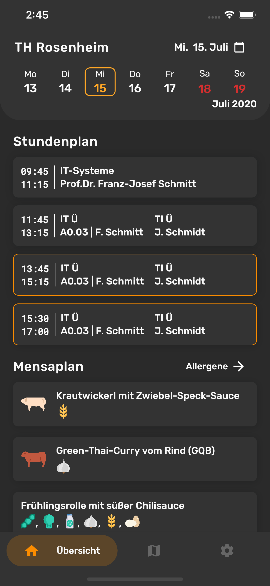
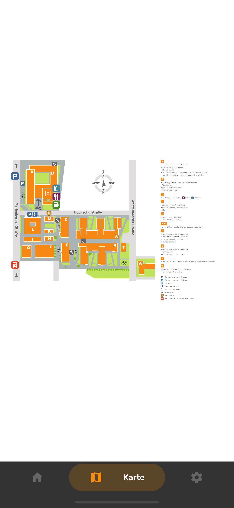
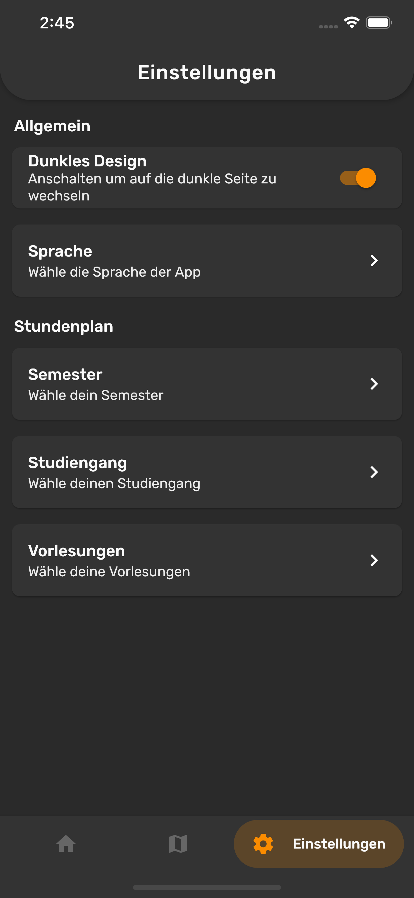
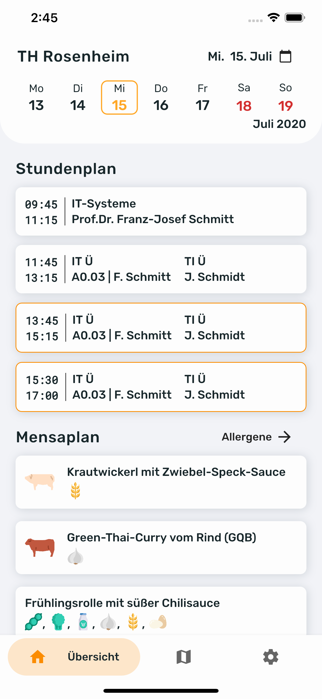
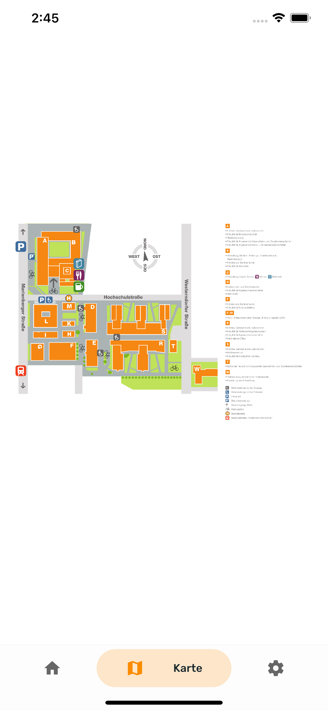
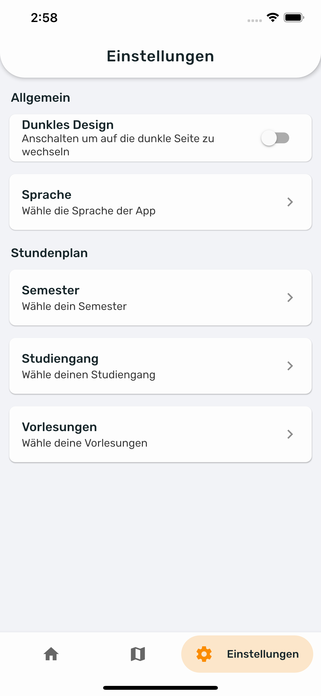

# Inoffizielle TH Rosenheim App

This Readme is also available in [English](README.md).

Dies ist eine Cross-Platform Flutter App die einen konfigurierbaren Stundenplan und Informationen über die Kantine für Studenten der Technischen Hochschule Rosenheim bereitstellt.

## Screenshots

Die angezeigten Daten sind nicht korrekt und nur zu demonstrationszwecken eingefügt worden.

### Dunkles Design

### Helles Design

## Installation

Da dies eine inoffizielle App ist kann Sie leider nicht im App Store beziehungsweise in Google Play veröffentlicht werden.

### Android

Um die App unter Android zu installieren kann einfach die neueste vorgefertigte apk Datei heruntergeladen werden.

TODO: Link einfügen wenn die build pipeline fertig ist.

### IOS / Aus Quellcode bauen

#### Einführung

Da IOS keine ähnlich simple alternative zu apk Dateien bietet muss man für ein iPhone die App aus dem Quellcode selbst bauen. Dazu wird allerdings ein Computer mit MacOS benötigt, da dieser Prozess nur auf Macs unterstützt wird. Für den Android build funktionieren auch Windows und Linux Systeme.

#### Setup

Als erstes muss Flutter auf dem eigenen System installiert werden, dazu bitte einfach den Schritten auf [flutter.dev](https://flutter.dev/docs/get-started/) folgen.

Nun kann das Repository geklont werden:

`$ git clone https://github.com/devnico/th_rosenheim.git`

Jetzt geht man in das eben geklonte Verzeichnis

`$ cd th_rosenheim`

und holt alle benötigten packages.

`$ flutter pub get`

#### Compilieren und Installieren

Stelle sicher das dein Handy verbunden und bereit ist. Unter Android muss die Funktion USB Debugging aktiviert sein.

Für IOS:

`$ flutter build ios --release && flutter install ios`

Für Android:

`$ flutter build apk --release && flutter install apk`

## Beitragen

Jeder Beitrag ist herzlich willkommen. Alle Mitwirkenden werden hier aufgelistet ([emoji key](https://allcontributors.org/docs/de/emoji-key)):

<!-- ALL-CONTRIBUTORS-LIST:START - Do not remove or modify this section -->
<!-- prettier-ignore-start -->
<!-- markdownlint-disable -->
<table>
    <tr>
    <td align="center"><a href="https://github.com/DevNico"> <b>DevNico</b></a> <a href="https://github.com/devnico/th_rosenheim/commits?author=devnico" title="Code">💻</a></td>
    </tr>
</table>
<!-- markdownlint-enable -->
<!-- prettier-ignore-end -->
<!-- ALL-CONTRIBUTORS-LIST:END -->

Dieses Projekt folgt der [all-contributors](https://allcontributors.org/docs/de/overview) Spezifikation.

## Lizenz

[GPL-3.0 License](LICENSE.md)